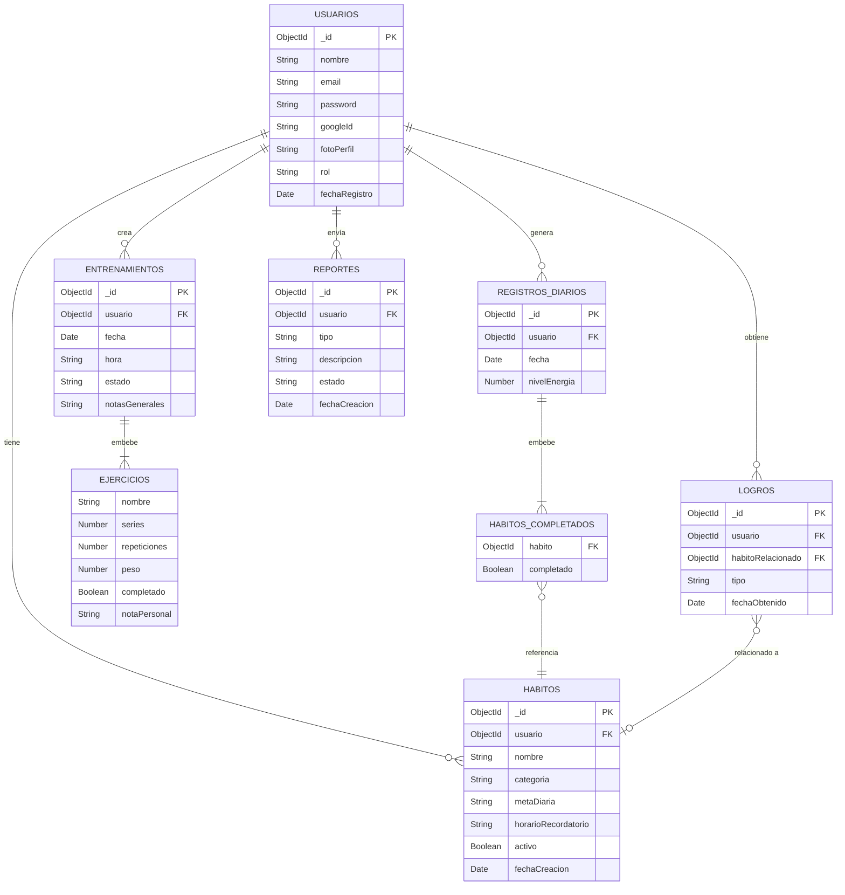

# WellSync — Diseño Inicial de Base de Datos

### MongoDB (NoSQL)

---

## Colecciones

### 1. `usuarios`

```json
{
  "_id": ObjectId,
  "nombre": String,
  "email": String,          //Unico
  "password": String,       //Hash (si no usa Google OAuth)
  "googleId": String,       //Si se registro con Google
  "fotoPerfil": String,     //URL de Cloudinary
  "rol": String,            //"usuario" | "administrador"
  "fechaRegistro": Date
}
```

---

### 2. `habitos`

```json
{
  "_id": ObjectId,
  "usuario": ObjectId,          //Ref -> usuarios
  "nombre": String,             //Eje. "Tomar agua", "Meditar"
  "categoria": String,
  "metaDiaria": String,         //Eje. "2 litros", "10 min"
  "horarioRecordatorio": String,
  "activo": Boolean,
  "fechaCreacion": Date
}
```

> **Referencia** al usuario, porque un usuario puede tener muchos hábitos y se consultan/filtran de forma independiente.

---

### 3. `registrosDiarios`

```json
{
  "_id": ObjectId,
  "usuario": ObjectId,          //Ref -> usuarios
  "fecha": Date,
  "nivelEnergia": Number,       //Escala del 1 al 5
  "habitosCompletados": [
    {
      "habito": ObjectId,       //Ref -> habitos
      "completado": Boolean
    }
  ]
}
```

> Se **embebe** la lista de hábitos completados del día, porque siempre se consulta junto con el registro diario y no tiene sentido pedirlo por separado.

---

### 4. `entrenamientos`

```json
{
  "_id": ObjectId,
  "usuario": ObjectId,          //Ref -> usuarios
  "fecha": Date,
  "hora": String,
  "estado": String,             //"pendiente" | "completado"
  "notasGenerales": String,
  "ejercicios": [
    {
      "exerciseId": String,       //ID proveniente de ExerciseDB
      "nombre": String,
      "series": Number,
      "repeticiones": Number,
      "peso": Number,
      "completado": Boolean,
      "notaPersonal": String
    }
  ]
}
```

> Los ejercicios se **embeben** dentro del entrenamiento porque siempre se leen y escriben juntos, nunca por separado.

---

### 5. `logros`

```json
{
  "_id": ObjectId,
  "usuario": ObjectId,          //Ref -> usuarios
  "tipo": String,               //"racha_7_dias", "primer_mes", etc.
  "habitoRelacionado": ObjectId,//Ref -> habitos (opcional)
  "fechaObtenido": Date
}
```

> **Referencia**, porque es información independiente que se consulta en su propia vista ("Mis logros").

---

### 6. `reportes`

```json
{
  "_id": ObjectId,
  "usuario": ObjectId,          //Ref -> usuarios (quién lo creo)
  "tipo": String,               //"bug", "contenido", etc.
  "descripcion": String,
  "estado": String,             //"abierto" | "en_proceso" | "resuelto"
  "fechaCreacion": Date
}
```

> **Referencia**, porque lo consulta el administrador de forma independiente, sin necesidad de cargar los datos completos del usuario.

---

# WellSync — Diagrama de Entidad Relación

### Base de Datos MongoDB (NoSQL)

---



---

## Notas del diagrama

| Símbolo     | Significado                                     |
| ----------- | ----------------------------------------------- |
| `\|\|--o{`  | Uno a muchos (obligatorio - opcional)           |
| `\|\|--\|{` | Uno a muchos (obligatorio - obligatorio)        |
| `}o--\|\|`  | Muchos a uno                                    |
| `}o--o\|`   | Muchos a uno (opcional)                         |
| **FK**      | Referencia mediante ObjectId a otra colección   |
| **Embebe**  | El subdocumento vive dentro del documento padre |

---

## Aclaraciones importantes

- **`HABITOS_COMPLETADOS`** y **`EJERCICIOS`** no son colecciones independientes en MongoDB, son subdocumentos embebidos dentro de `REGISTROS_DIARIOS` y `ENTRENAMIENTOS` respectivamente. Se representan por separado en el diagrama solo para que no genere confusion.
- **`LOGROS.habitoRelacionado`** es opcional (`o`), ya que algunos logros pueden no estar ligados a un hábito específico (ej. "Primer mes en la plataforma").
- Todas las relaciones con **`USUARIOS`** son mediante `ObjectId` (referencia), no embebidas.

### NOTA: Puede cambiar algun aspecto de la BD si en el momento del desarrollo se encuentra un posible mejora o refactorización.

[Volver al índice principal](README.md)
